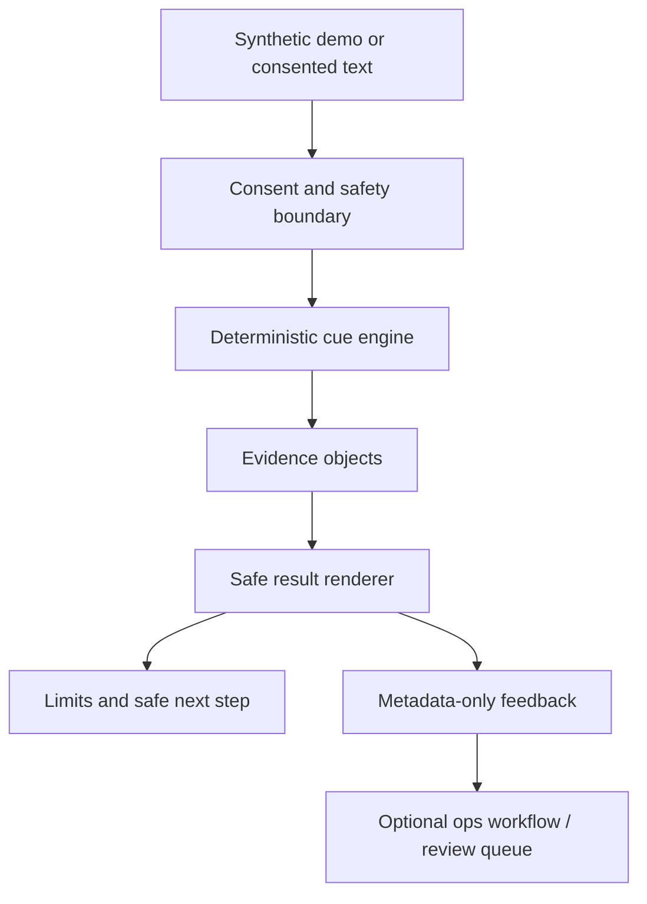

# Vibe Signal Architecture Overview

This is a simple architecture explainer for recruiters, CTOs, and technical interviewers. It describes the current product shape without claiming production model accuracy, legal/privacy approval, or workflow automation readiness.

## What runs where

- Web frontend runs on Vercel.
- Backend runs on Render with FastAPI.
- Synthetic demo is the safest first path because it does not require private text.
- Consented custom analyze uses the backend.

## Why deterministic-first

- Bounded output.
- Explainable cue logic.
- Evidence phrases before interpretation.
- No direct model truth claims.

## Safety boundaries

- Consent-gated custom input.
- No raw-chat persistence by design.
- Metadata-only feedback.
- No hidden-intent, deception, diagnosis, attraction, manipulation, neurotype, attachment-style, or relationship-outcome claims.

## Where n8n fits

- Optional ops workflow.
- Feedback triage.
- Smoke/report reminders.
- Review queues.
- Must not receive raw private content unless future review explicitly approves it.

## Current caveat

Custom-domain private analysis CORS/deploy verification is separate from this docs PR. The synthetic demo remains the recommended first path for reviews and interviews.
