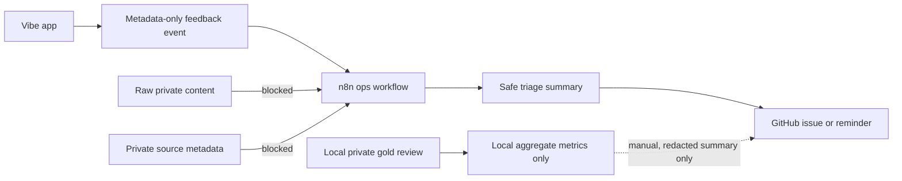

# Agent 9 - n8n Ops Workflow Plan

Date: 2026-06-05

Status: research_plan_requires_gpt_user_review.

## n8n Positioning

n8n is an optional operations/workflow automation layer around Vibe Signal. It is not the core analysis engine, not a model-training system, and not a path for private chat content.

The current repo posture is metadata-only n8n workflows for beta operations and demo support.

## Allowed Workflows

Allowed if payloads contain metadata only:

- beta tester intake routing;
- smoke-check reminders;
- production smoke result notifications;
- GitHub issue creation from safe operational summaries;
- feedback triage using result metadata only;
- CI failure notifications;
- reviewer task assignment by neutral row ID only;
- recruiter/demo follow-up tasks;
- incident notifications that do not include raw user text.

## Blocked Workflows

Blocked unless future rights/legal review and a separate security/privacy architecture review explicitly approve a new design:

- sending raw private chat content to n8n;
- sending private source metadata to n8n;
- sending local gold labels to cloud n8n;
- creating GitHub issues with private row text;
- provider fine-tuning triggers;
- external data download orchestration;
- model artifact upload;
- screenshots or workbooks containing private content.

## Architecture Diagram

## Reviewer Assignment Pattern

Allowed:

- assign neutral row IDs;
- assign cue-family coverage goals;
- assign review batch counts;
- route completion status;
- route aggregate disagreement counts.

Blocked:

- message text;
- private filenames;
- real-person-derived source labels;
- row screenshots;
- private evidence spans.

## Future Backlog

Safe n8n tasks:

- weekly smoke-check reminder;
- PR validation reminder;
- metadata-only feedback triage;
- beta intake checklist;
- legal review placeholder reminder;
- local evaluator completion reminder based on manual aggregate entry;
- recruiter demo task list.

Stop conditions:

- workflow requires raw private text;
- workflow requires private source ID;
- workflow uploads data/model artifacts;
- workflow makes product/legal compliance claims;
- workflow sends private labels outside local-only process.
